# Dapp, Custom Node: ToDo

- Links
  - [Ethereum and Solidity: The Complete Developer's Guide (Section 2), Udemy](https://www.udemy.com/ethereum-and-solidity-the-complete-developers-guide/learn/v4/content)

## 1. Truffle, Node
  - Truffle

  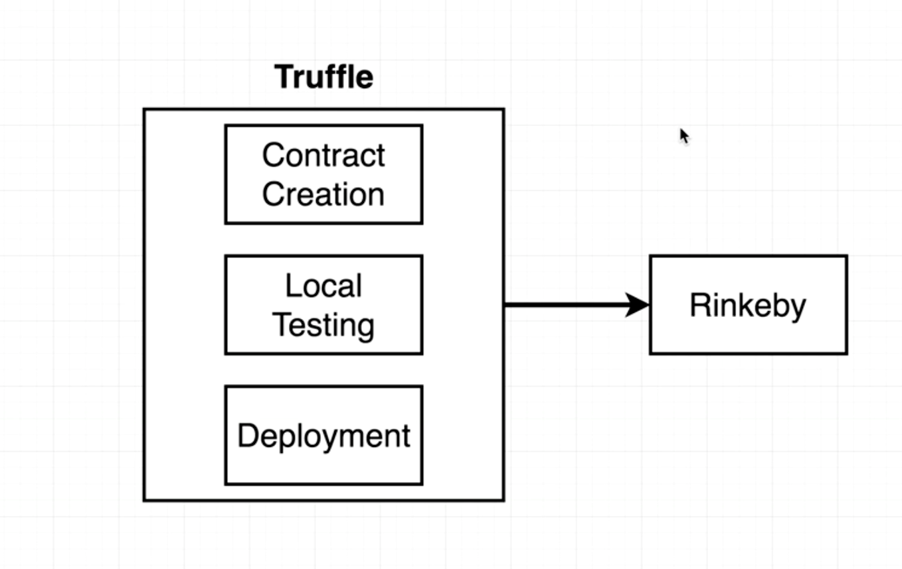

  - Node

  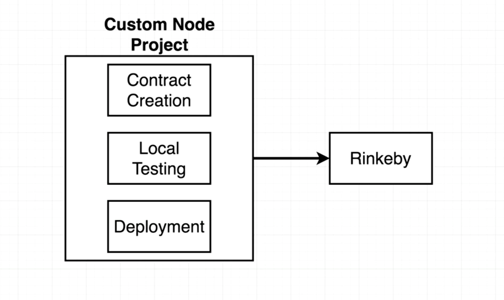

## 2. Boilerplate
  - Issues

  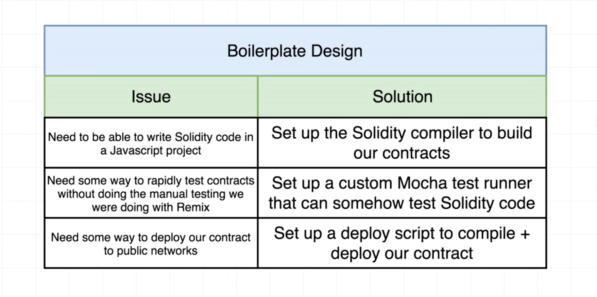

## 3. Project Directory Structure

  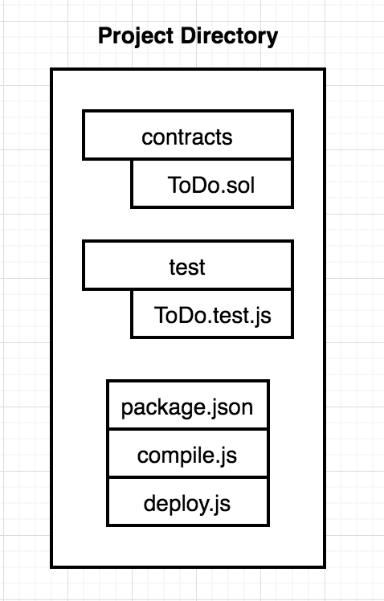

## 4. Compile
  - The deploy and testing process requires a compiled contract
  - Compiling solidity

  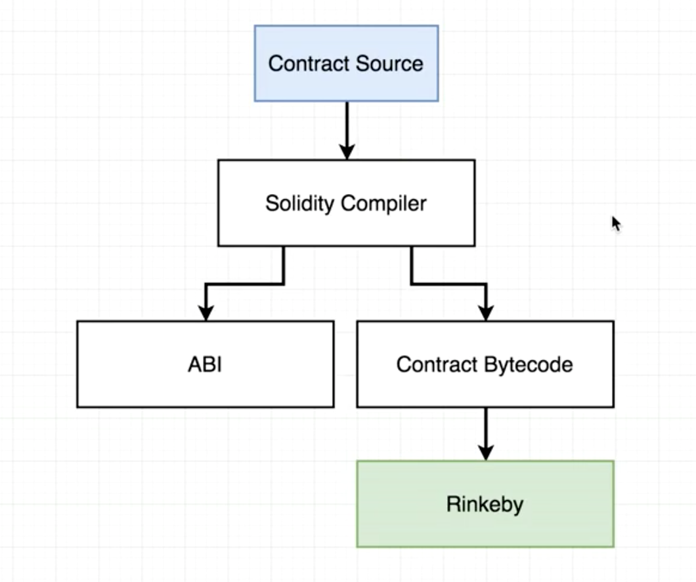

  - Install solc
  - Output of solc.compile(source, 1)
    - bytecode

    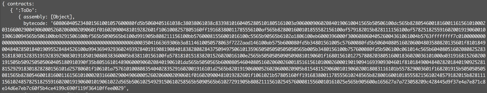

    - ABI (Communication layer between solidity and JS)

    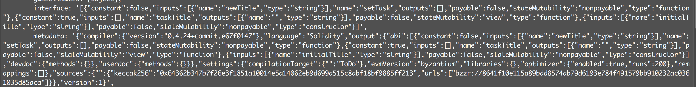

## 5. Test
  - Testing setup

  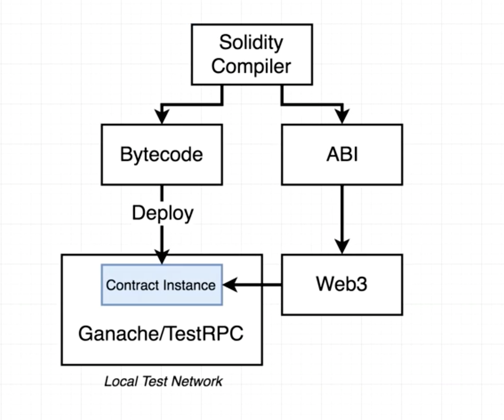

  - Web3
    - Versions

    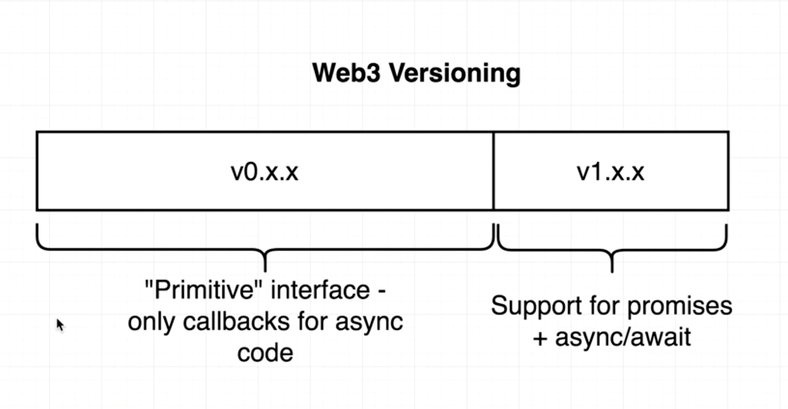

    - Connecting web3 to ganache
      - The provider is the communication layer between the web3 lib and some specific ethereum network e.g. ganache.provider()

    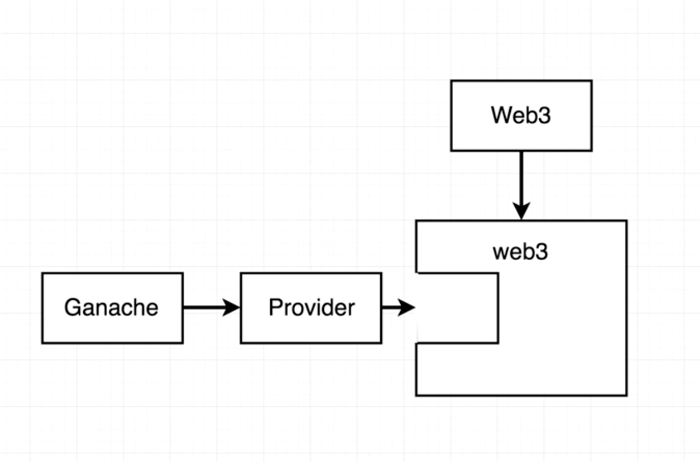

  - Ganache
    - Accounts
      - Use web3 to access the list of accounts that are created automatically by ganache. These accounts are by default unlocked

    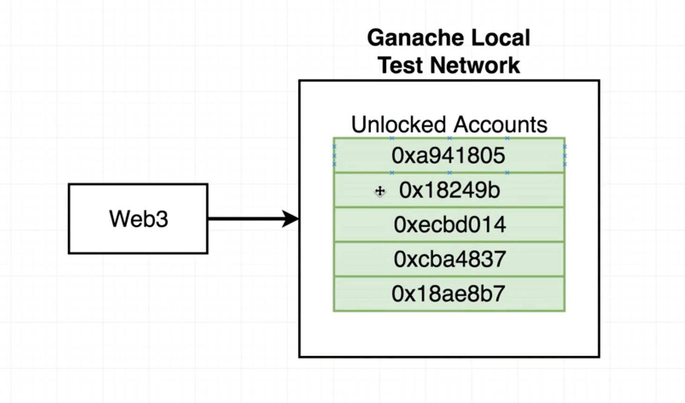

  - Mocha
    - Mocha Functions

    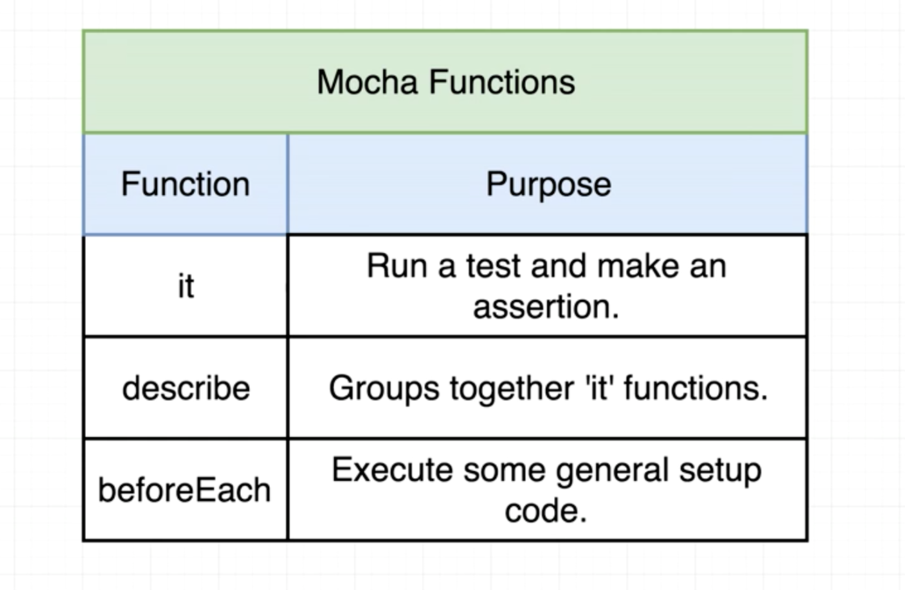

    - Mocha Flow

    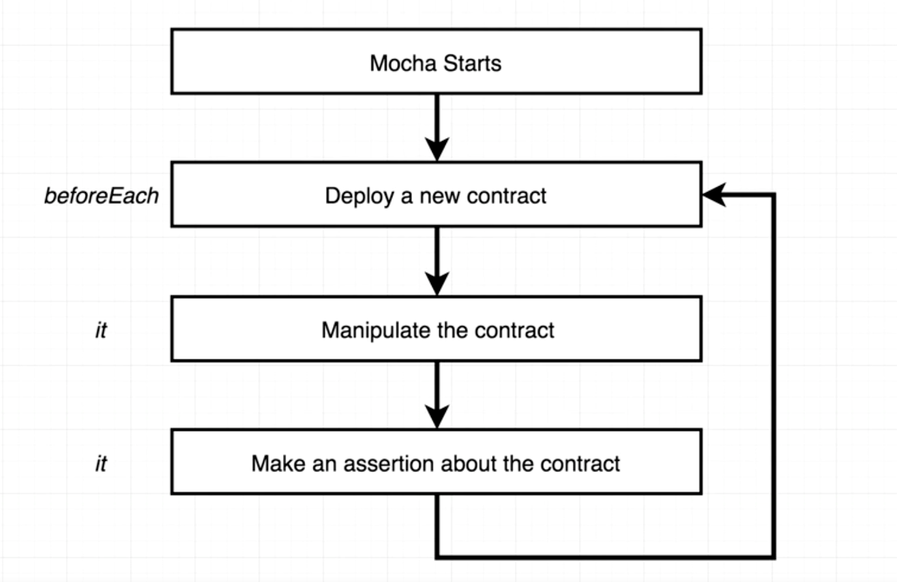

    - package.json

    ```javascript
    scripts: {
      "test": "mocha"
    }
    ```
    - Web3 with contracts (web3.eth.contracts)
      - Used for deploying new contracts or interacting with existing contracts that exist on the blockchain already

      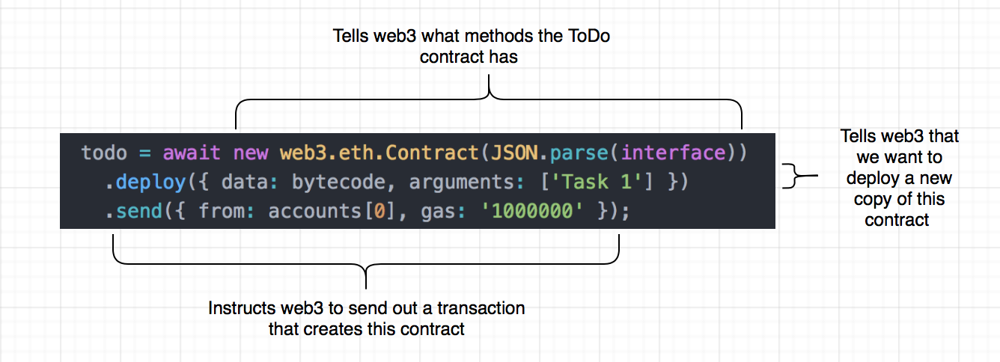

      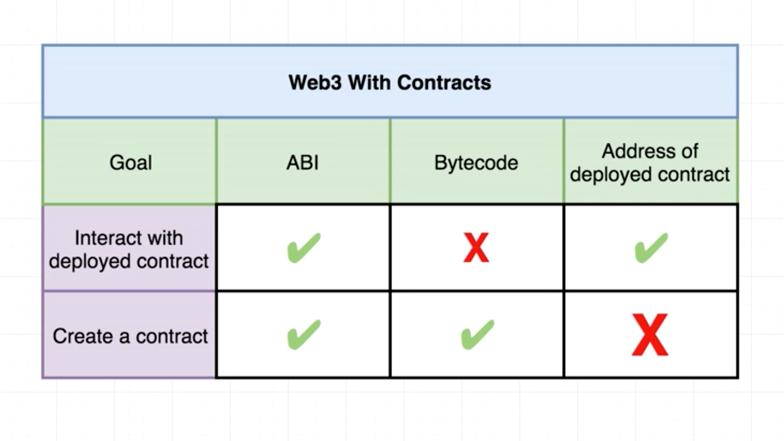

## 6. Deploy
  - Deploying to a test network (Rinkeby) using infura
    - Unlike the local network, the test network does not have any unlocked accounts included in the provider. For test networks, the provider needs to have an account that it's going to use as a source of ether for the deployment. The account mnemonic can be used to unlock the accounts and use the ethers within it to deploy a contract.
    - To deploy to the Rinkeby network, need to connect to a node that exists on the network to deploy the contract.

  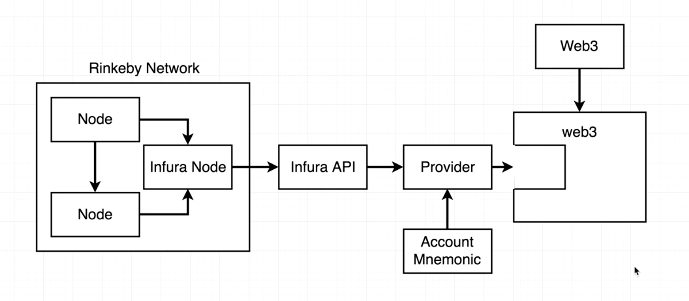

  - Truffle hdwallet provider: use it to connect to the Rinkeby network hosted through infura and unlock an account to use.

  - Output
    - Attempting to deploy from account 0x813755d5e161452191E926100734005E7Eca734e
    - Contract deployed to 0x18C375a93B5858809D27E8c7326520f8e037604f

  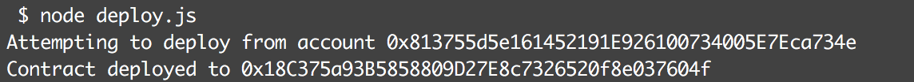

  - Etherscan
    - rinkeby.etherscan.io
